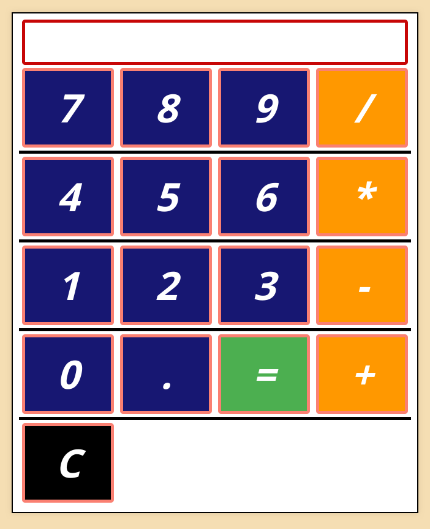

# 🧮 Calculator

A simple web app calculator built using **HTML**, **CSS**, and **JavaScript** as part of [The Odin Project’s Foundations course](https://www.theodinproject.com/paths/foundations/courses/foundations).

[Demo](https://mx-99.github.io/calc/)

[Blog post](https://mx-99.github.io/posts/calculator/calculator/)
---

## 🚀 Features

- Basic arithmetic operations: **addition**, **subtraction**, **multiplication**, and **division**  
- chaining operations (e.g., `2 + 3 * 4`) 
- Keyboard input 

---
